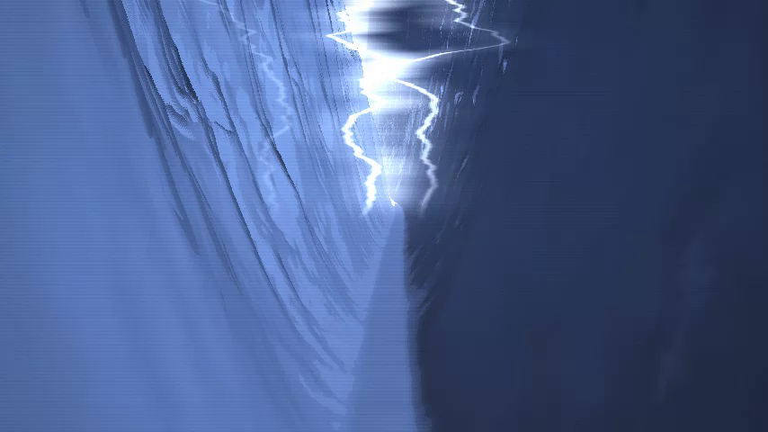

# Genny — Thunder Canyon

An audio-reactive **music-video visualizer**. A POV camera drives through a
narrow, winding canyon; the mountains breathe with the beat and melody, and
**lightning cracks across the storm sky on the heavy hits** — a stylized,
cel-shaded, non-photorealistic look built to visualize AC/DC's *Thunderstruck*.

It's a single self-contained `index.html` (raw WebGL raymarching + the Web
Audio API — no libraries, no build step, works offline). Point it at your own
audio file and it reacts live; hit **Rec** to export a video.



## Run it

```
# any static server, e.g.
npx serve .          # then open the printed URL
# or just double-click index.html (file:// works too)
```

Then **click to start**, press **Load audio** (or drag a track anywhere on the
window), and play. If you drop an audio file at `assets/thunder.mp3` it is
**auto-loaded** on start.

> Opening over `http://` (a static server) enables the `assets/` auto-load and
> is the most reliable path. `file://` works but can't auto-load from `assets/`
> — use **Load audio** / drag-and-drop instead.

### Audio formats
Anything the browser decodes natively: **`.mp3`** (safest), `.m4a`/`.aac`,
`.wav`, `.ogg`, `.opus`, `.webm`. Browsers decode by the file's actual
content, not its extension, so a `.mpeg`/`.mpg`/`.mp2` file that's really MP3
audio underneath (a common side effect of some audio-trimming tools) plays
fine — the loader/drag-drop accept a wide extension list so it isn't
rejected up front. A genuine legacy MPEG **video** container is a different
story: browsers generally can't decode that natively. Use the
[Python renderer](python/) for those — it decodes via ffmpeg, which reads
virtually any container.

### Controls
| Key / Button | Action |
|---|---|
| **Load audio** / drag-drop | pick the track to visualize |
| ▶ / **Space** | play / pause |
| ● **Rec** / **R** | start/stop recording → downloads a `.webm` (video **+** audio) |
| **H** | hide / show the UI |
| **F** | fullscreen |

Before any file is loaded it runs a **demo mode** with a synthetic beat so the
scene is alive on first open.

## How it maps to the brief

| Requirement | Implementation |
|---|---|
| POV camera "driving" through a narrow canyon | Fragment-shader raymarched height-field. The camera follows a winding path (`pathX`) down a narrow gap between two walls, moving forward every frame. |
| Mountains shift up/down & in size to beat + melody | Bass energy (`uLow`) scales overall mountain height/size (they *breathe* & grow on the beat); mids (`uMid`) drive the ridge/crest detail (the melody). |
| Lightning on the intense beats ("Thunder") | A bass onset/beat detector fires a flash envelope (`uBeat`); on each strike a jagged, branching bolt is drawn in the sky, the clouds light up, and the canyon floods with cold light. |
| Stylized, non-photoreal, but clearly mountains + lightning | Posterized **cel shading**, ridged-noise crestlines, a limited stormy blue palette, aerial fog, vignette and faint scanlines. Readable as canyon + lightning, deliberately not photorealistic. |

### Audio → visuals (signal flow)
`<audio>` → `MediaElementSource` → `AnalyserNode`
- **low / mid / high** bands → envelope-followed → shader uniforms driving
  mountain size, crest detail and shimmer.
- **lightning trigger** — a broadband onset (weighted low/mid/high) has to
  clear two gates: a short-term local threshold (a real transient, not just
  sustained loudness) **and** a slow ~6s baseline of "how loud has the song
  been recently" — this second gate is what keeps a sustained riff from
  re-triggering on every note; only moments that are loud *for the song*
  fire a strike. A refractory period keeps strikes as discrete moments.

Tuning knobs live at the top of the fragment shader (palette, wall steepness,
fog, `halfW` canyon width) and in `analyze()` (band ranges, thresholds, the
slow-baseline multiplier, flash decay).

This is genuinely audio-reactive, not hardcoded to this song — it analyzes
whatever file you load in real time, so it works the same way on the full
track, a different section, or an entirely different song.

## Exporting a video

**In-app (recommended, full quality):** press **Rec**, let it play, press again
to stop — the browser records the canvas + audio to a `.webm` at your display's
framerate using your real GPU.

**Offline / [Python renderer](python/) (recommended for batch/headless use):**
`python3 python/render.py song.mp3 -o out.mp4` — the identical shader running
under moderngl, driven by real `librosa`/`numpy` audio analysis, rendered
frame-by-frame and muxed with ffmpeg. Renders far faster than a browser
recording on any machine with a GPU, works headless (servers/CI), and accepts
any ffmpeg-readable input format. See [`python/README.md`](python/README.md).

## Notes
- **Audio is not committed.** `assets/*` audio and `renders/*` are git-ignored:
  the visualizer is BYO-audio, and copyrighted tracks stay local. Put your own
  file at `assets/thunder.mp3` (or load it in the UI).
- No external dependencies or network calls — the whole visualizer is the one
  `index.html`.
